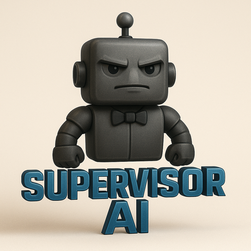

<p align="center">
  
</p>

# SupervisorAI

> ## 🏆 **MiniMax Week Hackathon Entry — Track 1: Reasoning**
> **An agent that holds a plan, delegates the work, and fact-checks itself.**
> Powered by **MiniMax-M3** served on **GMI Cloud**.

---

## Explore the project

| | Link |
|---|---|
| 🛰️ **Live interactive demo** | Replay the M3 supervisory loop and approve the HITL gate — **[hungryshmorez.github.io/Supervisorai](https://hungryshmorez.github.io/Supervisorai/)** |
| 📘 **The Codex** (encyclopedia) | The complete reference — engine, loop, every component, both skills — **[/codex.html](https://hungryshmorez.github.io/Supervisorai/codex.html)** |
| 💻 **Repository** | Source, tests, and both VORTEX-OS skills — **[github.com/hungryshmorez/Supervisorai](https://github.com/hungryshmorez/Supervisorai)** |
| 🔀 **Pull request** | The full build history — **[PR #1](https://github.com/hungryshmorez/Supervisorai/pull/1)** |
| 🎬 **Demo runbook** | Scene-by-scene recording guide — **[`docs/DEMO.md`](docs/DEMO.md)** |
| 📄 **Sample live trace** | A full sanitized MiniMax-M3 run — **[`docs/sample_live_run.txt`](docs/sample_live_run.txt)** |
| ⚙️ **Core engine** | The product — Python package, FastMCP-served — **[`src/`](src/)** |
| 🖥️ **Command-line implementations** | Experimental bash clients of the same ideas — **[`implementations/`](implementations/)** |

> The two website links go live once **GitHub Pages** is enabled (Settings → Pages → *Deploy from a branch* → `/docs`). Both pages are self-contained and also render offline.

**What runs the system:** the **core engine** is the Python package in
[`src/`](src/) — typed, tested, async, and FastMCP-served. Use it for anything
production-facing. The bash skills in [`implementations/`](implementations/) are
downstream command-line clients of the same ideas, for quick local experiments.
→ [New here? Start with `docs/CONFIGURATION.md`](docs/CONFIGURATION.md) for a
config map, a one-command preflight check, and a production-readiness checklist.

---

## Problem statement

Autonomous agents fail in a specific, expensive way: they *lose the plot*. A
coding agent starts fixing a bug and quietly drifts into rewriting unrelated
files; a research assistant confidently cites a source that says the opposite of
what it claims; a multi-step task reports "done" while a dependency silently
failed. The missing piece is not a bigger worker model — it is a **supervisor**
that holds the plan, checks every step against it, and refuses to declare
success until the work actually verifies.

**SupervisorAI** is that supervisor. It uses MiniMax-M3's reasoning to run a
closed loop over a team of workers:

> **Plan → Delegate → Audit → Correct → (verified) Synthesis**

M3 decomposes a goal into a validated task DAG, delegates each task to an
M3-backed worker, then puts on its supervisor hat and audits every output
against the plan — catching hallucinations, errors, and drift. Failed or drifted
outputs are re-prompted with a concrete correction hint. Only when *every*
dependency passes verification does the system synthesize a final, verified
result. Every stage is streamed as a live, tagged execution trace.

## Architecture

```
                        ┌─────────────────────────────────────────────┐
                        │          SUPERVISOR  (MiniMax-M3)            │
                        │   holds the plan · audits · self-corrects    │
                        └───────────────┬─────────────────────────────┘
              1. PLAN                   │   4. CORRECT (re-prompt on fail/drift)
        decompose goal → DAG           │        ▲
                        ┌──────────────▼────────┴──────────┐
                        │        Orchestrator (DAG)         │
                        │   get_ready_tasks() · dependencies│
                        └───────┬─────────────────┬─────────┘
                  2. DELEGATE   │                 │   3. AUDIT
                                ▼                 ▼
                        ┌───────────────┐   ┌─────────────────────────┐
                        │  M3 Workers   │──▶│  Supervisor verification │
                        │  (per task)   │   │  • M3 audit verdict      │
                        │  via MCP      │   │  • QualityAnalyzer (heur)│
                        └───────────────┘   │  • LLM judge (2nd opinion)│
                                            │  • Coherence/drift check  │
                                            └─────────────┬────────────┘
                                                          │ all pass?
                                                          ▼
                                              5. VERIFIED SYNTHESIS
```

The single integration point is **`src/llm/client.py` (`LLMClient`)** — every
LLM-using component (orchestrator decomposer, `LLMJudge`, `ResearchAssistor`)
depends on it, so retargeting this one class flips the whole platform onto
MiniMax-M3.

## Studio capabilities (agent roster · continuity · deliverables · HITL)

On top of the reasoning loop, SupervisorAI runs as an autonomous studio:

- **Specialist agent roster** — named worker personas live in `agents/*.json`
  (`coder.python`, `coder.javascript`, `writer.narrative`, `reviewer.code`, …).
  M3 assigns the best specialist to each task during planning, and each worker
  runs with its persona as its system prompt.
- **Continuity engine** — pass `continuity_rules` (era, character, tone, safety
  canon) to `run_goal`; they are injected into every worker prompt, folded into
  each audit's checks, and guarded by a fast deterministic pre-check. Violations
  trigger a self-healing correction.
- **On-disk deliverables** — every *verified* worker output is written to
  `deliverables/<file>` (with markdown-fence stripping, so `.html`/`.py`/`.json`
  are valid standalone files). A run produces real artifacts, not just text.
- **Human-in-the-Loop (Deep-Sleep) gate** — tasks the planner marks
  `high_stakes` (finalizing/packaging a shippable artifact) **halt** before they
  are written and require explicit human approval. Approve/deny via the
  `hitl_status` / `hitl_approve` / `hitl_deny` MCP tools (or an approval callback
  in code). **Never auto-approved** — the gate is the last line of defense.

> These four capabilities began as a sibling prototype (**VORTEX-OS**) and were
> consolidated onto this Python engine — so there is **one** verified system, not
> two. The original bash skills still ship as downstream **command-line
> implementations** under [`implementations/`](implementations/); see
> [Command-line implementations](#command-line-implementations-experimental) at
> the end of this README.

## GMI Cloud / MiniMax-M3 integration

| | |
|---|---|
| **Endpoint** | `https://api.gmi-serving.com/v1/messages` (Anthropic Messages-compatible) |
| **Base URL** | `https://api.gmi-serving.com/v1` (env `GMI_BASE_URL`) |
| **Model** | `MiniMaxAI/MiniMax-M3` (env `SUPERVISOR_MODEL`) |
| **Auth** | `x-api-key: $GMI_API_KEY` and `Authorization: Bearer $GMI_API_KEY` (both sent) |

`LLMClient` adds production concerns on top of the raw endpoint:
retry with exponential backoff (on 429/5xx/network), token-budget accounting,
robust structured-JSON extraction (handles ```json fences and embedded JSON),
tool-calling pass-through, SSE streaming, and a **graceful, context-aware mock
fallback** so the demo, tests, and MCP server never hard-crash when no key is
set.

## Quickstart

```bash
# 1. Install
pip install -r requirements.txt

# 2. Configure your GMI key
cp .env.example .env      # then edit .env and paste your GMI_API_KEY
#   (or just:  export GMI_API_KEY="<your key>")

# 3. Preflight — validate config + confirm you're on LIVE M3 (not the silent mock)
python scripts/preflight.py           # add --require-live in CI

# 4. Run the turnkey demo — plan, delegate, audit, self-correct, verify
python demo.py

# 5. Run the test suite
PYTHONPATH=src pytest tests/ -q

# 6. (optional) Run the MCP server exposing the supervisor as tools
PYTHONPATH=src python src/server/main.py
```

**Deploying for real?** Read **[`docs/CONFIGURATION.md`](docs/CONFIGURATION.md)**
for the full configuration matrix and a production-readiness checklist, and
**[`docs/FEEDBACK_LOOP.md`](docs/FEEDBACK_LOOP.md)** for how the Expectimax agent
persists and learns from human feedback (with the exact math).

The demo runs a real scenario — an incoming bug report on a mock repo — and
prints a live trace tagged `[SUPERVISOR - M3]`, `[DISPATCH]`, `[AUDIT]`,
`[DRIFT DETECTED]`, `[RECOVERY]`, `[SYNTHESIS]`, finishing with a verified PR
summary and a per-task audit ledger. With no `GMI_API_KEY` it still runs
end-to-end on a deterministic mock so you can see the loop before wiring a key.

> **Security note:** never commit your `GMI_API_KEY`. It belongs in `.env`
> (gitignored) only. Rotate any key that has been shared in plaintext.

---

## Project Overview

This project is a sophisticated, AI-powered system designed to supervise, manage, and assist other AI agents. It has evolved from a simple monitoring script into a multi-layered platform with advanced capabilities for intelligent oversight and autonomous operation.

The system is built around three core concepts:
*   **Supervision:** A supervisor agent that uses a probabilistic model (Expectimax) to watch over a working agent, predict potential issues, and intervene when necessary.
*   **Orchestration:** An autonomous orchestrator that can manage a pool of specialized agents, decompose high-level goals into a dependency graph of tasks, and manage the entire execution workflow, including delegating complex tasks to sub-orchestrators.
*   **Assistance:** A proactive research assistant that can detect when an agent is stuck, perform web searches to find solutions for its errors, and provide intelligent suggestions to help it recover.

## 2. Core Features

This project includes a rich set of features, demonstrating a robust and intelligent architecture.

### **Supervision Engine**

*   **Intelligent Supervisor Agent:**
    *   Uses an **Expectimax algorithm** (`supervisor_agent/expectimax_agent.py`) to make nuanced decisions about whether to `ALLOW`, `WARN`, `CORRECT`, or `ESCALATE` an agent's output. This is not based on simple rules, but on a probabilistic model of future outcomes.
    *   The decision-making is based on a weighted evaluation of the agent's state, including output quality, task drift, error count, and resource usage.

*   **Code-Aware Supervision:**
    *   The supervisor can now understand code quality. When an agent produces Python code, the system uses the **`pylint` static analysis tool** (`analysis/code_analyzer.py`) to check for errors, code smells, and style issues.
    *   The number of errors found is factored directly into the `AgentState` passed to the Expectimax agent, making its decisions about code much more intelligent.

*   **Multi-modal Supervision:**
    *   The supervisor now has a new sense: vision. It can evaluate image-based outputs from agents.
    *   When an agent's output is an image URL, the `LLMJudge` uses a vision-capable model (e.g., Claude 3 Opus) to evaluate the image against the task goals.

*   **Feedback-Driven Learning:**
    *   The supervisor can **learn from user feedback**. The dashboard allows a human to correct a bad decision, and this feedback is used to retrain the weights of the Expectimax agent's evaluation function via `supervisor_agent/feedback_trainer.py`.
    *   This creates a powerful self-improvement loop, allowing the supervisor's judgment to get better over time.

### **Orchestration Engine**

*   **Autonomous Orchestrator with Multi-LLM Support:**
    *   Manages a pool of specialized agents with different capabilities.
    *   Features an **LLM-powered task planner**. The system is architected to use multiple LLM providers concurrently (e.g., Anthropic, OpenAI), loading its configuration from `config/llm_config.json`.
    *   Different models can be used for different tasks (e.g., a fast model for planning, a powerful model for judging) to optimize for cost and performance.

*   **Sub-Orchestration:**
    *   For extremely complex goals, the main orchestrator can now delegate tasks to **sub-projects**. The LLM planner is instructed to identify tasks that are themselves large projects and assign them a `sub_orchestration` capability.
    *   The orchestrator then creates a new, nested `ProjectGoal` and monitors it, allowing for hierarchical, recursive problem-solving.

*   **Resource-Aware Task Assignment:**
    *   The orchestrator is now aware of agent system resources. Agents can report their CPU and memory load via a new API endpoint.
    *   The `find_available_agent` logic has been enhanced to filter out agents with high resource usage (e.g., >90%) and to prioritize assigning tasks to the least-loaded agent available.

*   **The Agent Factory:**
    *   The system is capable of building new agents for itself. When a "build agent" goal is submitted, the orchestrator creates a sub-project to manage a team of coding agents that write, test, and register a new agent into the pool.

### **Assistance & UI**

*   **Proactive Research Assistant:**
    *   The supervisor can detect when an agent is "stuck". It then autonomously formulates a search query, uses **Google Search** to find relevant help articles, and uses an **LLM to synthesize a helpful suggestion**.

*   **Cost Analysis:**
    *   A `CostTracker` service logs every LLM call made by the system. It uses model-specific pricing to calculate the cost of each call and provides a detailed report, which can be viewed on the dashboard.

*   **Interactive Dashboard with Real-Time Updates:**
    *   A comprehensive web dashboard (`examples/dashboard.html`) serves as the central UI.
    *   The dashboard now features **real-time log and status streaming** via a dedicated WebSocket connection, making the UI highly responsive.
    *   It includes an **interactive debugger** that visualizes the Expectimax agent's entire decision tree as a flowchart.

## 3. System Architecture

The project is organized into a standard Python project structure:

*   `src/supervisor_agent/`: Contains the core `SupervisorCore` and the `ExpectimaxAgent`.
*   `src/orchestrator/`: Contains the `Orchestrator` and its data models.
*   `src/researcher/`: Contains the `ResearchAssistor`.
*   `src/analysis/`: Contains the `CodeQualityAnalyzer`.
*   `src/agent_factory/`: Contains templates for building new agents.
*   `src/llm/`: Contains the multi-LLM client architecture (`base.py`, `manager.py`, etc.).
*   `src/server/`: Contains the main ASGI server (`main.py`).
*   `examples/dashboard.html`: The all-in-one web interface.
*   `tests/`: Contains unit and integration tests.

## 4. Setup and Installation

To get the project running, follow these steps:

1.  **Set up a Python virtual environment:**
    *   This project uses Python's standard `venv` module.
    ```bash
    python3 -m venv .venv
    ```

2.  **Activate the virtual environment:**
    ```bash
    source .venv/bin/activate
    ```

3.  **Install dependencies:**
    *   Install all required packages using the `pip` from your new virtual environment.
    ```bash
    pip install -r requirements.txt
    ```

4.  **Configure API Keys (Optional):**
    *   Create a `.env` file in the root directory or set environment variables for the LLM providers you wish to use.
    ```
    ANTHROPIC_API_KEY="your-anthropic-key"
    OPENAI_API_KEY="your-openai-key"
    ```
    *   If API keys are not set, the relevant clients will return mocked responses.

## 5. How to Run the System

1.  **Start the Server:**
    *   The application is an ASGI web server and should be run with `uvicorn`. The following command also sets the `PYTHONPATH` correctly, which is required for the application's imports to work.
    ```bash
    PYTHONPATH=$(pwd)/src .venv/bin/uvicorn src.server.main:mcp --port 8765
    ```
    *   You should see output from `uvicorn` indicating the server is running on `http://127.0.0.1:8765`.

2.  **Use the Dashboard:**
    *   Open the `examples/dashboard.html` file in your web browser. This file is self-contained and will connect to the local server automatically.

## Command-line implementations (experimental)

> **The core product is the Python engine in [`src/`](src/)** — typed, tested,
> async, and MCP-served. The bash skills below are **downstream command-line
> clients** of the same ideas, kept for local experiments and terminal demos.
>
> **Which should I use?** — **Python (`src/`) for enterprise / production**
> (concurrency, tests, MCP, a typed dependency graph). **Bash
> (`implementations/`) for quick local experiments** and terminal runs.

Both live under [`implementations/`](implementations/) and call MiniMax-M3 on GMI
Cloud via their `lib/minimax.sh` bridge (deterministic offline fallback with no key):

- **[`implementations/vortex-os/`](implementations/vortex-os/)** — creative flavor:
  4-tier chain of command, HITL gate, continuity, on-disk deliverables.
  `./skill.sh --dispatch-master <objective.md>`.
- **[`implementations/vortex-os-v3/`](implementations/vortex-os-v3/)** — software
  flavor: a 30+ agent roster with consensus voting, cost governance, and quality
  gates. A real `adapters/minimax_m3.sh` drives the adapter chain.

## Path to production

The engine is verified and green; here's the concrete path from
hackathon-strong to enterprise-ready — with what's already done in this branch:

**Done**
- ✅ **Green CI** ([`.github/workflows/ci.yml`](.github/workflows/ci.yml)) — the full test suite + config preflight on every push.
- ✅ **Loud-fail preflight** instead of a silent mock, with a `--require-live` gate for CI/deploy.
- ✅ **Live-M3 CI gate is active** — the `GMI_API_KEY` is wired in as a repo Actions secret and every push runs one real request to MiniMax-M3, so a green build proves the deploy is on live M3, not the silent mock.
- ✅ **Configuration matrix + production checklist** ([`docs/CONFIGURATION.md`](docs/CONFIGURATION.md)).
- ✅ **Feedback loop** persisted, version-controlled, and charted ([`docs/FEEDBACK_LOOP.md`](docs/FEEDBACK_LOOP.md)).

**Next**
- **Secrets** — graduate `GMI_API_KEY` from a CI/repo secret to a managed secrets store (rotation, per-environment scoping) rather than `.env`.
- **Auth & multi-tenancy** on the FastMCP server — per-caller keys, rate limits, quotas.
- **Live drift widget** — surface `weight_history.jsonl` as a real-time dashboard chart (today it renders as a generated PNG).
- **Shared weight store** — move `config/weights.json` to a shared backend so the learned policy stays consistent across instances.
- **Observability** — structured metrics/traces (token spend, audit pass-rate, intervention counts) to a monitoring backend.
- **Containerization** — a Dockerfile whose entrypoint runs `preflight --require-live` before it serves traffic.

## 6. Future Roadmap

This project has a rich roadmap for future development.

### Planned Features
*   **Interactive Goal Definition:** Create a UI for drag-and-drop task planning.
*   **Authentication & Multi-User:** Add a proper user login system.

### Next Frontier Ideas
*   **The Ethics Guardian:** A specialized supervisor to enforce an "ethical constitution."
*   **The Self-Improving Supervisor (Meta-Learning):** A supervisor that learns from its own interventions to improve its policies.
*   **Predictive Intervention Engine:** A system that analyzes an agent's work in real-time to predict and prevent failures.
*   **Full System Autonomy:** Connect the orchestrator to external data streams to allow it to discover and propose its own goals.
*   **Meta-Supervision:** A system that can analyze its own performance and autonomously refactor its own source code or prompts.
*   **Human-AI Symbiosis:** Evolve the UI into a true collaborative partner with conversational planning and deeply explainable AI (XAI).
*   **Decentralized Swarm Orchestration:** Move from a single orchestrator to a decentralized swarm of orchestrators.
*   **Embodied AI & Physical World Control:** Connect the orchestrator to physical hardware (robotics, IoT).

## 7. Credits & acknowledgments

**Created and directed by [12matt3r](http://doesntmatter.us).**

SupervisorAI was **originally built for MiniMax's Agent Hackathon**, where it earned
an **Honorable Mention** (with a prize). It has been substantially rebuilt and
expanded since — into the MiniMax-M3–powered supervisory engine documented here.

| Role | |
|---|---|
| **Concept, direction & original system** | **[12matt3r](http://doesntmatter.us)** |
| **Original hackathon build** | **Jules** — co-created the original Honorable-Mention entry |
| **Software design, engineering & MiniMax-M3 integration** *(this build)* | **[Claude](https://claude.com/claude-code)** — Anthropic's Claude Code (Opus) |
| **Reasoning model** | **MiniMax-M3** |
| **Model serving & infrastructure** | **GMI Cloud** |

*Directed by 12matt3r · originated with Jules · rebuilt with Claude · powered by MiniMax-M3 on GMI Cloud.*
